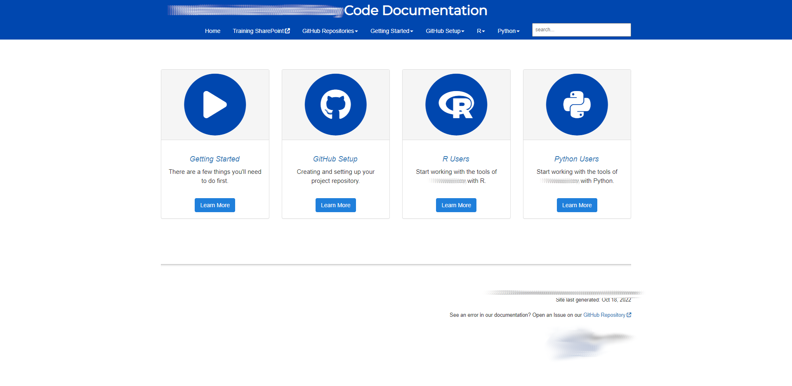
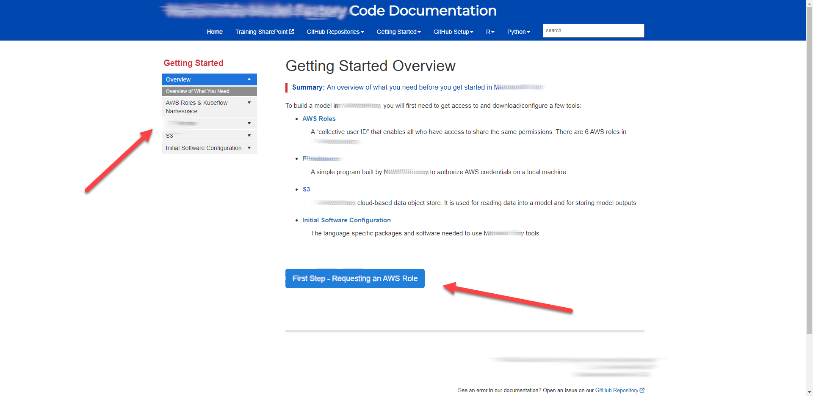
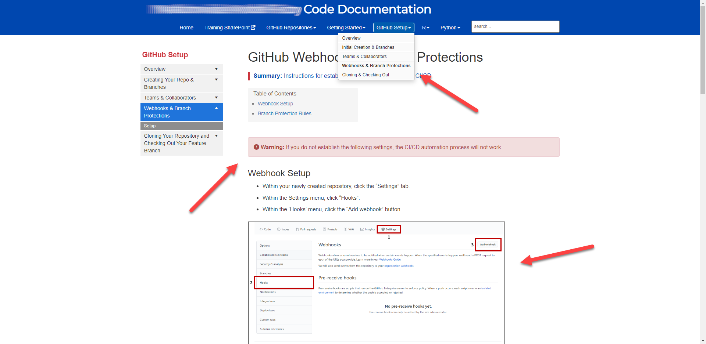

When my Fortune 100 data science overhauled its software stack, shifting to cloud-based ML tools, leadership struggled with the mountain of information it needed to communicate to associates. [Images](https://www.techtarget.com/searchitoperations/definition/Docker-image), [containers](https://www.docker.com/resources/what-container/), and [Docker](https://en.wikipedia.org/wiki/Docker_(software)); [S3](https://aws.amazon.com/s3/), [SageMaker](https://aws.amazon.com/sagemaker/), and [Kubeflow](https://www.kubeflow.org/); [Informatica](https://www.informatica.com/products/cloud-integration.html), [Spark](https://spark.apache.org/), and [Databricks](https://www.databricks.com/)—where to begin? how should it be organized? how could process changes be tracked?

At first, leadership favored the simplest option: simply directing associates to publicly available documentation. The option had its appeal. After all, most of the companies producing the parts of our stack already had passable, and in some cases quite good, documentation. But early interviews with our new users revealed the limitations of this approach. Associates were overwhelmed by the options outlined in publicly available documentation; they didn't know what features we could use in our enterprise-tailored version of the tools. And, of course, none of the public options documented things like internal access requests and the configuration of our custom Git repository template. Given the significant technical changes we were asking associates to undertake, employing a hodgepodge of documentation felt like it would be adding one more hurdle before our team.

I proposed an alternative: building a custom documentation site from the ground up using [Markdown](https://www.markdownguide.org/), [Jekyll](https://jekyllrb.com/), and [GitHub Pages](https://pages.github.com/). This approach, essentially a [docs as code](https://www.writethedocs.org/guide/docs-as-code/) workflow, had the added benefit of version controlling changes to the documentation with [Git](https://git-scm.com/), which wasn't available with the other option we had been using ([SharePoint](https://www.microsoft.com/en-us/microsoft-365/sharepoint/collaboration)). My proposal was accepted, and, despite having little experience with my doc tool stack, I quickly got to work.

The finished product was a comprehensive, user-friendly, 80+ page documentation site. At the time of this writing, it remains one of the most regularly consulted technical documentation resources not only within my department but across the enterprise.

Below I include a few screenshots from the site to highlight its features. **No proprietary information is featured in these images.**

In this first image, you can see the site landing page. I was unsatisfied with the out-of-the-box landing page options available from my Jekyll theme, so I built this page from scratch using the [Bootstrap framework](https://getbootstrap.com/). Other notable features here include:

- Header font and color aligned via custom CSS to enterprise standards 
- Buttons built with appropriate icons sourced from [Font Awesome](https://fontawesome.com/icons)
- Link to the GitHub repository's Issues page
- A functional search bar

In this next image, you'll see one of the second-level landing pages. A couple of things worth noting here:

- On the left, a collapsible side navigation bar. This navigation bar remains fixed in place as a user scrolls down the page. I adjusted the Jekyll theme's Javascript to enable this functionality.
- A next page button. Because our development team explained these steps happening in a sequence, I thought it logical to connect one page to the next in a natural way.

Next, you can see a typical content page from the site. A few  features evident here include:

- A functional top navigation bar, complete with dropdown functionality. It was important to me that the site maximize navigability, and the top navigation bar offers but one path for users to access the content they need.
- An "admonition" call-out box. A "Warning" is used here, but "Tip," "Note", and "Caution" call-outs can be found throughout the site, too.
- Images to match the text description. Because these instructions direct users to navigate to a feature of GitHub most of them were not familiar with, I thought including images would help them feel confident about the tasks they are being asked to perform.

