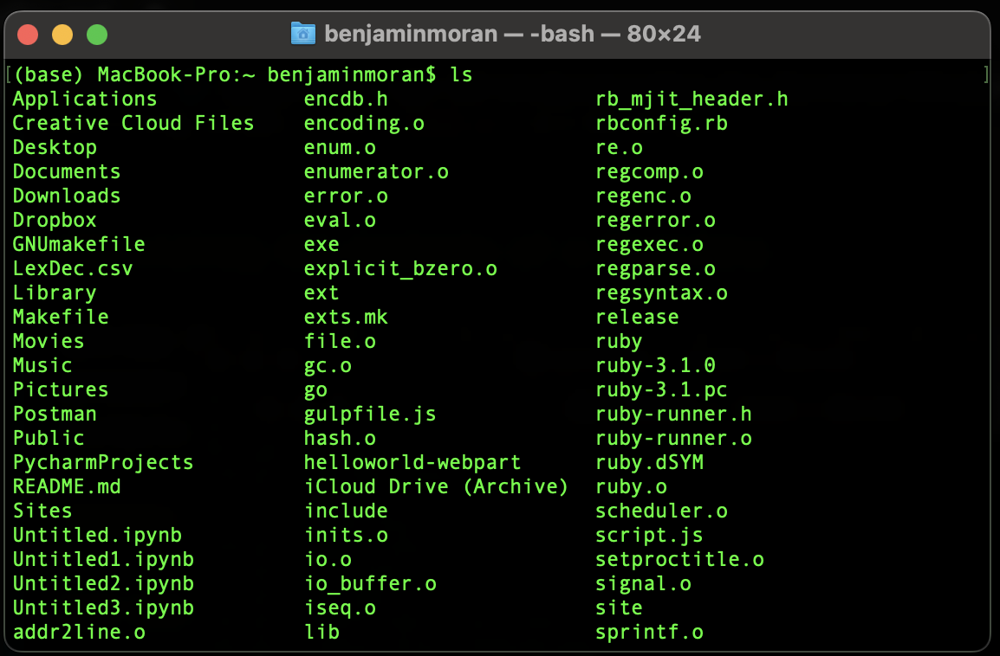

This guide is intended for technical writers who have no or limited experience with the command line.

Windows, Mac, and Linux computers have slightly different command line interfaces (CLIs). Below, I include separate instructions for all three. After reading the first two sections, skip to the instructions  that apply to the system you're using.

Note: for Linux, I base my instructions on the Ubuntu distribution. There may be minor differences for you if are using a different distribution.

## What Is the Command Line?

The command line is a program that makes an operating system perform actions. It works by processing textual commands written by a user. In this respect, it differs from most programs, which which take their directions from a user's mouse clicks. These other programs are known as "graphical user interfaces" (GUIs).

The command line goes by different names. Mac and Linux calls it **Terminal**. Windows has two CLIs, one called **Command Prompt** and one called **PowerShell**. Powershell is more versatile, and it is the Windows CLI I will use for instructions below.

## Why Would a Technical Writer Want to Know the Command Line?

The biggest reason for a technical writer to learn the command line is that it's central to the [docs as code](https://www.writethedocs.org/guide/docs-as-code/), an approach to technical writing that has ballooned in popularity since the early 2010s. Docs as code involves a combination of a markup language, a static site generator, version control, and web deployment. In some cases, knowing the command helps work with these tools. In other cases, these tools cannot be used without the command line.

Another reason to learn the command line is that it can help you do your job more efficiently. After you've grown accustomed to the command line, you'll find that tasks like creating new files and moving files around can be done much quicker with the command line. Learning the command line also provides you most of the skills needed to learn "shell scripting," which is a way of saving CLI commands so you can run them again. With shell scripting, you can automate boring tasks.

Finally, there are some things you might get asked to do that would be extremely painful to do without the command line. For example, imagine you have a few hundred documentation pages, each of which has a file name ending with three digits. Now imagine your manager asks you to add a `0` to the start of these numbers in preparation for the files rolling over into the thousands. If you had to do that manually—right-click, "Rename," add `0`, click away from the file name—it would be a mind-melting task. With the command line, you can implement this change in one line of commands. 

## Instructions Table of Contents

Ready to get started? Click the link that applies to your system.

- **[Mac Instructions](#mac-instructions)**

- **[Windows Instructions](#windows-instructions)**

- **[Linux Instructions](#linux-instructions)**

## Mac Instructions

### Opening the Command Line

The command line can be found the same way you find your other programs. 

1. Open a Finder window.
2. Use the search bar to search for **Terminal**.
3. In the search returns, locate **Terminal** and double-click to open it.

I recommend adding **Terminal**  to your MacOS Dock. Click and drag the **Terminal** icon from your search returns and drop it in your Dock.

## Understanding the Terminal Window

When first opened, the command line info will display some information. This section explains what you're seeing.

Here's a newly opened Terminal window. Your color schema may be different.

Here's what you're seeing:

- "Last login" gives a timestamp for the last time you opened a Terminal window. If you open a new window (⌘ + N), the timestamp will change.
- The next three lines relate to the "shell," which is the invisible program used to convert your textual commands into computer actions. Don't worry about this for now.
- The last line tells you five things:
  - `(base) Macbook Pro:`. This tells you the machine you're working on. It'll differ for your machine, unless you're on a Macbook Pro.
  - `~`. This indicates your home directory. Terminal will start in your home directory when you open a new window.
  - `benjaminmoran`. This indicates your "relative working directory." "Relative" here means "short form," and "working directory" indicates where the terminal is currently "looking." More on this soon.
  - `$`. This is the prompt. It may be a `%` for you. It indicates where you will start entering your commands.
  - `▮`. This is the cursor. It's likely flashing. It tells you where you're typing. It will move as you type something.

### Print the Working Directory

Every new prompt line in Terminal provides a shortened form of your present working directory. Sometimes, you'll need to know the complete form of your present working directory. To do so, type `pwd` and press enter.

Contrast the line first line with what the Terminal returned. The first line only lists `benjaminmoran`, the relative path. The absolute path printed on the next line shows that `benjaminmoran` is a directory sitting under the `Users` directory.

### Listing the Contents of a Directory

When you open a Finder window in a directory, you'll see something like this (if you haven't changed your settings):

When you are in a directory in Finder, you see the contents of that directory.

Unlike Finder, Terminal does not automatically list the contents of the present working directory. To see the contents of the present working directory, type `ls` and press Enter.

When listed, directories are printed alongside files. Directory do not have a file extension; files do.

You can also use `ls` to list the contents of other directories outside your present working directory. If the directory is nested beneath the present working directory, simply add the relative path of the directory after `ls`. This is called "passing an argument" to the command.

Here you see the contents of a directory that is neither my present working directory nor a subdirectory of my present working directory. Notice that I had to include a leading `/`. That's part of the absolute path.

### What Are Flags?

With `ls` we learned that "arguments" can be passed to command. Arguments tell the computer on what object (file, directory, etc.) it should perform an action. 

"Flags" can also be passed to a command. Flags provide the computer additional information on options or settings you would like to apply to the command. Flags are usually signalled by a leading hyphen (e.g., `-b`), though some flags use two hyphens (e.g., `--version`).

### Listing All Contents of a Directory

By default, `ls` returns all the *visible* content in a directory. However, there may be hidden content present. To see visible *and* hidden contents of a directory, use `ls -a`. The `-a` flag stands for "all."

The hidden contents, which have a leading `.`, are printed first in the returns, followed by the visible contents.

Like many other CLI commands, `ls` can take both a flag and an argument in the same command. Enter `ls -a <absolute path>` to print all contents of a directory.

### Creating a New File

Use the `touch <file-name.extension>` command to create new files in Terminal. You can create a new file using any extension. 

Terminal won't print a confirmation after a successful `touch`. You can verify the file was created by running `ls`.

### Open a File

Let's try opening the file we just created. Use the `open <file-name.txt>`. You'll know you've succeeded because Mac will open your empty file in your default `.txt` file reader (likely TextEdit).

### Changing Your Working Directory

You know that Terminal defaults to the home directory when opened. What if you want to perform actions outside that directory? The easiest way is to change the working directory and perform actions afterward.

To change your working directory, enter `cd <pathway>`. Here, I jump down one directory from `benjaminmoran` into `Documents`. The change will be reflected in the text of the next line, which shows `Documents` as the relative path.

We can use `cd` to move up a directory, too. Use `cd ../`.

You can move up or down more than one directory at a time. Here, I jump down two directories in one command. In the next line, I chain two `../`s to return to my original directory.

Like we saw with `ls`, `cd` allows us to change directories using an absolute path regardless of our current directory. 

### Tab Completion

There's a handy trick to make opening a file or changing your directory even quicker: [tab completion](https://www.howtogeek.com/195207/use-tab-completion-to-type-commands-faster-on-any-operating-system/). When writing out a directory, for example, I can press `TAB` after typing a few characters, and Terminal will fill in the directory. Here, I typed `Doc` before pressing `TAB`, saving me a little bit of time. When you add up those little bits of time saved, you start to realize how much more efficient this is than navigating with your mouse. 

Note that, with tab completion, your computer looks for unique values based on your initial input. If it encounters two file or directory names with the same root, the terminal will stop at the point that the two file names diverge. It then expects you to clarify which file or directory you intend to use. If I have two sub-directories in my present working directory, one called `Document` and one called `Documents`, and I type `cd Doc` and hit `TAB`, Terminal will fill in `ument`, stopping at `cd Document`. It expects me to either press `Enter` to change directory into `Document` or enter an `s` before entering into the `Documents` directory.

### Making a New Directory

The final basic command is `mkdir <directory-name>`, the command you use to create a new directory. Terminal won't print a confirmation after you press enter. Run an `ls` to confirm the directory's creation.

### Next Steps

You now know most of the CLI commands you'll need as a technical writer. Consult [this cheat sheet](https://www.guru99.com/linux-commands-cheat-sheet.html) to explore other commands. (This cheat sheet is for Linux, but Mac's Terminal follows Linux commands.)

If you'd like to take the next steps in learning the docs as code approach to documentation, check out my introductions to [Git](https://benbarksdale.netlify.app/docs/guides/introduction-to-git-for-technical-writers/) and [GitHub]().

## Windows Instructions

Note: where applicable, I'll be using PowerShell command [aliases](https://freshman.tech/get-cmdlet-alias/). Aliases are shorthand forms of their commands. Most basic PowerShell commands have an alias.

### Opening the Command Line

1. Open the Start Menu.
2. Search for **PowerShell** in the search bar.
3. When the **PowerShell** icon appears, double-click to open the program.

### Understanding the PowerShell Window

When first opened, the command line info will display some information. This section explains what you're seeing.

Here's a newly opened PowerShell window:

- The first three lines of text include copyright information and an advertisement. You can ignore them.
  
- The final line communicates four things:

  - `PS` — This is the PowerShell indicator. It distinguishes PowerShell from other Windows’ other CLI, Command Prompt.

  - `C:\Users\moranb7` — This indicates your "absolute working directory." This indicates the full pathway where Terminal is currently "looking." More on this soon.
  
  - `>` — This is the prompt. It indicates where you will start entering your commands. 
  
  - `_` [not pictured] — This is the cursor. It's probably flashing. It tells you where you're typing. It will move as you type something.

### Print the Working Directory

Coming soon!

### Making a New Directory

The final basic command is `mkdir <directory-name>`, the command you use to create a new directory. Terminal won't print a confirmation after you press enter. Run an `ls` to confirm the directory's creation.

### Next Steps

You now know most of the CLI commands you'll need as a technical writer. Consult [this cheat sheet](http://ramblingcookiemonster.github.io/images/Cheat-Sheets/powershell-basic-cheat-sheet2.pdf) to explore other commands.

If you'd like to take the next steps in learning the docs as code approach to documentation, check out my introductions to [Git](https://benbarksdale.netlify.app/docs/guides/introduction-to-git-for-technical-writers/) and [GitHub]().

## Linux Instructions

### Opening the Command Line

1. Click the Show Applications button.
2. Click the Terminal icon.
   
I recommend adding Terminal to the dash. Click and drag the Terminal icon from the Show Applications menu and drop it in the dash.

### Understanding the Terminal Window

When first opened, the command line info will display some information. This section explains what you're seeing.

Here's a newly opened Terminal window:

Here’s what you’re seeing:

- `benbarksdale@Ubuntu:` —This string of text indicates the username and the name of the computer on which you’re working.
  
`~` — This indicates your home directory. Terminal will start in your home directory when you open a new Terminal window. By default, your home directory is `/home/<username>`.
- `$` — This is the prompt. It indicates where you will start entering your commands.
- `▮` — This is the cursor. It's probably flashing. It tells you where you're typing. It will move as you type something.

### Print the Working Directory

Every new prompt line in Terminal provides a shortened form of your present working directory. Sometimes, you'll need to know the complete form of your present working directory. To do so, type `pwd` and press enter.

Contrast the line first line with what the Terminal returned. The first line only lists `~`, the special character indicating that the relative path is the home directory. The absolute path printed on the next line shows that `benjaminbarksdale` is a directory sitting under the `home` directory.

### Listing the Contents of a Directory

When you open a Files window in a directory, you'll see something like this (if you haven't changed your settings):

When you are in a directory in Files, you see the contents of that directory.

Unlike Files, Terminal does not automatically list the contents of the present working directory. To see the contents of the present working directory, type `ls` and press Enter.

When listed, directories are printed alongside files. Directory do not have a file extension; files do. Terminal also prints files in a different color than directories.

You can also use `ls` to list the contents of other directories outside your present working directory. If the directory is nested beneath the present working directory, simply add the relative path of the directory after `ls`. This is called "passing an argument" to the command.

Here you see the contents of a directory that is neither my present working directory nor a subdirectory of my present working directory. Notice that I had to include a leading `/`. That's part of the absolute path.

### What Are Flags?

With `ls` we learned that "arguments" can be passed to command. Arguments tell the computer on what object (file, directory, etc.) it should perform an action. 

"Flags" can also be passed to a command. Flags provide the computer additional information on options or settings you would like to apply to the command. Flags are usually signalled by a leading hyphen (e.g., `-b`), though some flags use two hyphens (e.g., `--version`).

### Listing All Contents of a Directory

By default, `ls` returns all the *visible* content in a directory. However, there may be hidden content present. To see visible *and* hidden contents of a directory, use `ls -a`. The `-a` flag stands for "all."

The hidden contents, which have a leading `.`, are printed alongside the visible contents.

Like many other CLI commands, `ls` can take both a flag and an argument in the same command. Enter `ls -a <absolute path>` to print all contents of a directory.

### Creating a New File

Use the `touch <file-name.extension>` command to create new files in Terminal. You can create a new file using any extension. 

Terminal won't print a confirmation after a successful `touch`. You can verify the file was created by running `ls`.

### Open a File

Let's try opening the file we just created. Use the `open <file-name.txt>`. You'll know you've succeeded because Mac will open your empty file in your default `.txt` file reader (likely TextEdit).

### Changing Your Working Directory

You know that Terminal defaults to the home directory when opened. What if you want to perform actions outside that directory? The easiest way is to change the working directory and perform actions afterward.

To change your working directory, enter `cd <pathway>`. Here, I jump down one directory from `benjaminbarksdale` into `Desktop`. The change will be reflected in the text of the next line, which shows `Desktop` as the relative path.

We can use `cd` to move up a directory, too. Use `cd ../`.

You can move up or down more than one directory at a time. Here, I jump down two directories in one command. In the next line, I chain two `../`s to return to my original directory.

Like we saw with `ls`, `cd` allows us to change directories using an absolute path regardless of our current directory. 

### Tab Completion

There's a handy trick to make opening a file or changing your directory even quicker: [tab completion](https://www.howtogeek.com/195207/use-tab-completion-to-type-commands-faster-on-any-operating-system/). When writing out a directory, for example, I can press `TAB` after typing a few characters, and Terminal will fill in the directory. Here, I typed `Doc` before pressing `TAB`, saving me a little bit of time. When you add up those little bits of time saved, you start to realize how much more efficient this is than navigating with your mouse. 

Note that, with tab completion, your computer looks for unique values based on your initial input. If it encounters two file or directory names with the same root, the terminal will stop at the point that the two file names diverge. It then expects you to clarify which file or directory you intend to use. If I have two sub-directories in my present working directory, one called `Document` and one called `Documents`, and I type `cd Doc` and hit `TAB`, Terminal will fill in `ument`, stopping at `cd Document`. It expects me to either press `Enter` to change directory into `Document` or enter an `s` before entering into the `Documents` directory.

### Making a New Directory

The final basic command is `mkdir <directory-name>`, the command you use to create a new directory. Terminal won't print a confirmation after you press enter. Run an `ls` to confirm the directory's creation.

### Next Steps

You now know most of the CLI commands you'll need as a technical writer. Consult [this cheat sheet](https://www.guru99.com/linux-commands-cheat-sheet.html) to explore other commands.

If you'd like to take the next steps in learning the docs as code approach to documentation, check out my introductions to [Git](https://benbarksdale.netlify.app/docs/guides/introduction-to-git-for-technical-writers/) and [GitHub]().
