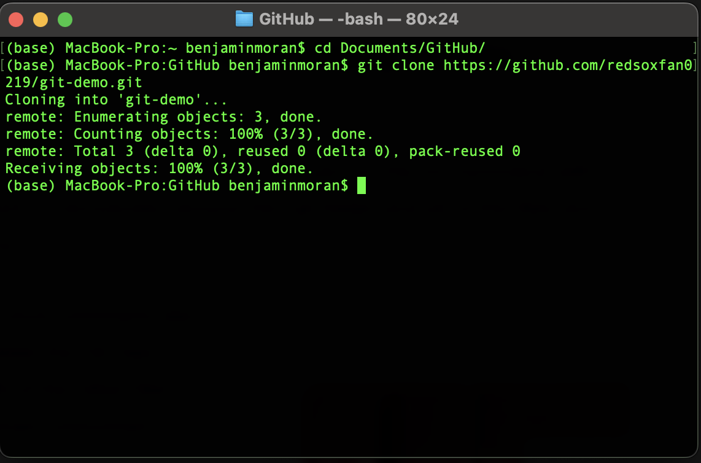
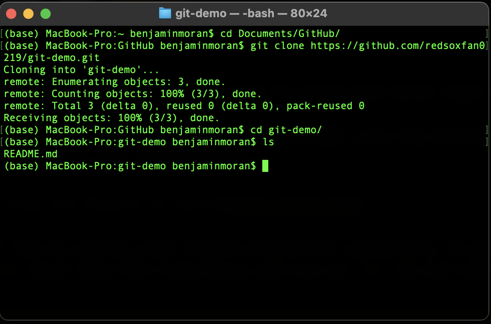
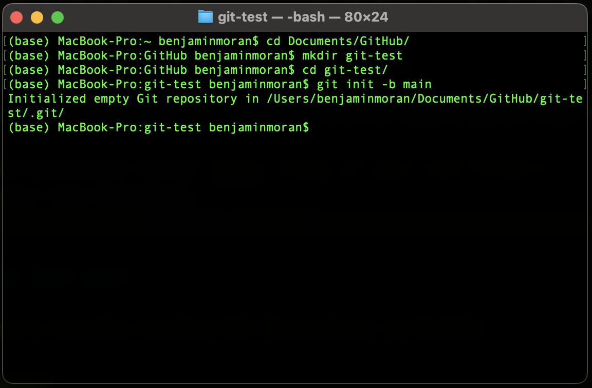
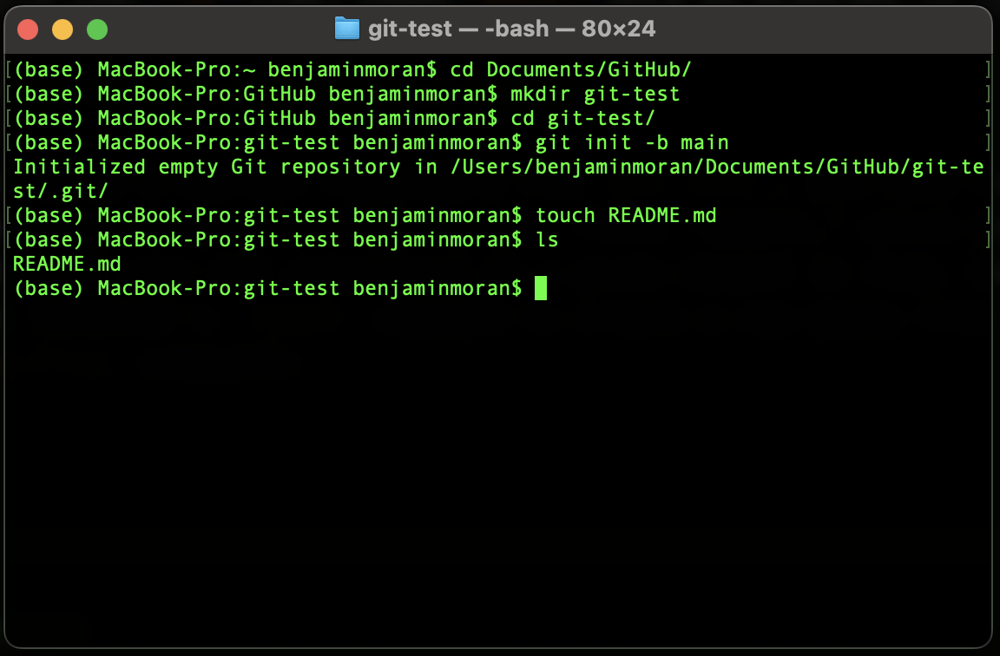
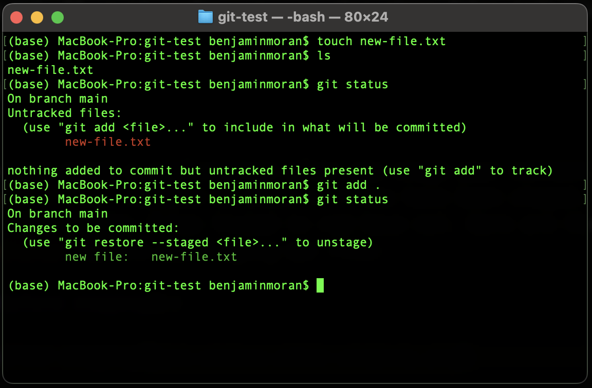
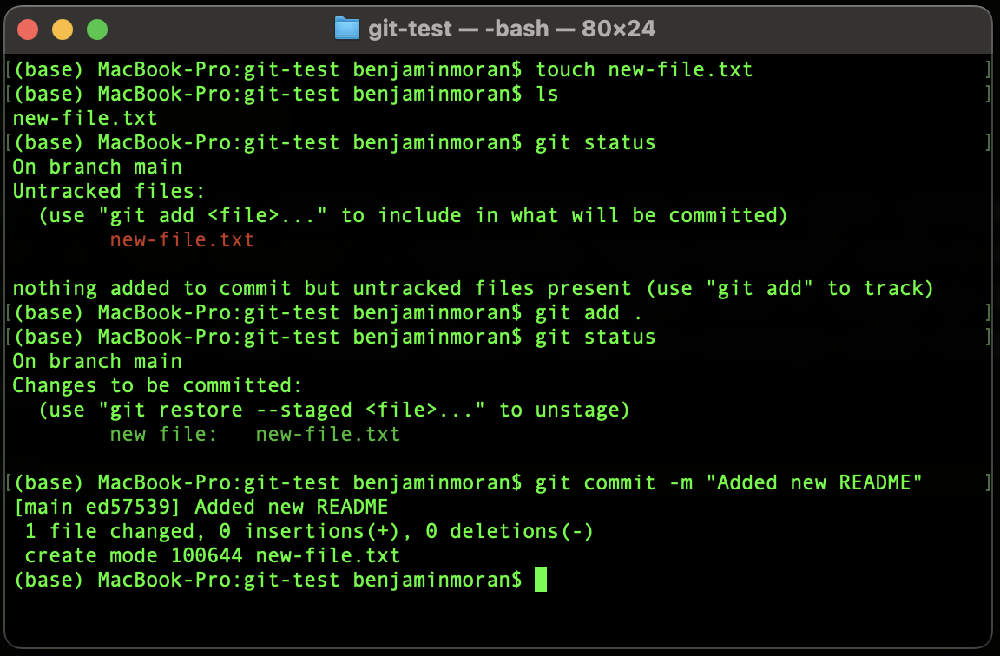
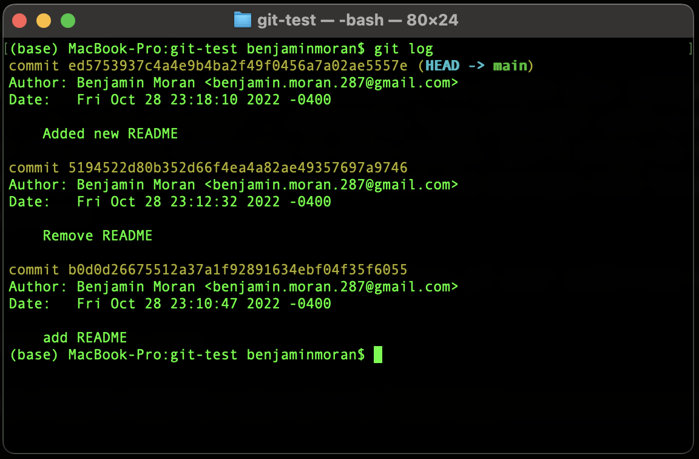
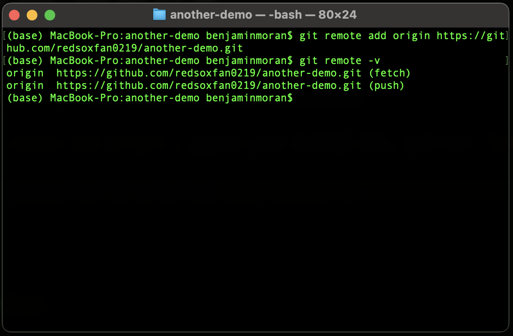
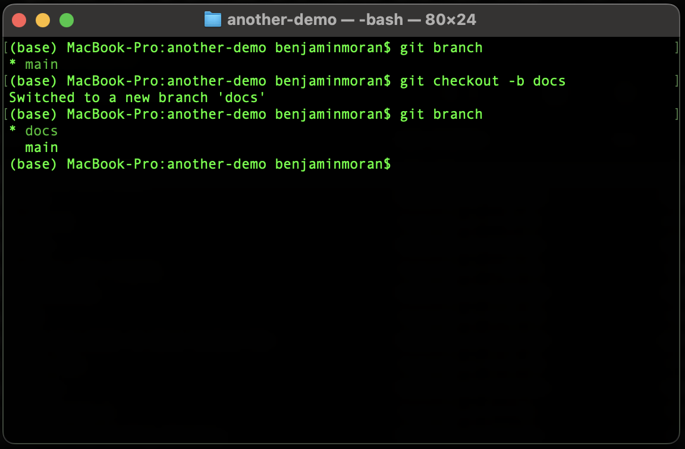

Increasingly, technical writing jobs require knowledge of something called "version control. The most popular version control system is a program called [Git](https://git-scm.com/). It's commonplace now for TW job posts to list Git as a required skill.

This page provides an explanation of what Git is and how to use it. I emphasize topics of interests to technical writers, especially those who write or are interested in writing developer documentation.

If you don't want to read the explanation of what version control and Git are, you can jump to either the [Git Instructions](#git-instructions) or [Git Cheat Sheet](#git-cheat-sheet).

**Important**: These instructions assume some familiarity with the command line. If you are new to the command line, start with my [Introduction to the Command Line for Technical Writers](https://benbarksdale.netlify.app/docs/guides/introduction-to-the-command-line-for-technical-writers/).

## What Is Version Control?

Version control is simply a way of  tracking changes made to files stored within a directory on a computer. There's a bit more to it, but that's a good enough definition for now.

## Why Should I Know Version Control?

Think about instances where you've worked on a document with a peer using a program like Microsoft Word. You probably ran into situations where you had to maintain different file versions. You may have exchanged several emails with attachments named `Working Document_v2`, `Working Document_v2.1`, or `Working Document_Final`.

If you've experienced situations like the one described above, you've already experienced the reason why version control is necessary. It's inevitable that the system described above will break down. Someone will forget to download the latest version from their email, or someone will download the right version but forget to re-save with a different `_v<>` number. 

The other problem with this approach is not knowing what changes were made in each file version. Maybe you can remember broadly what each version covers. But to version a document properly, you would need a computer-like memory for the details or every version—every paragraph, every word, every comma—and you would need to be able to hold those multiple versions in your head and compare them line-by-line. That's functionally impossible.

Therefore, we need some way of systematically tracking changes from one version to the next, some way to understand what changes are associated with each version of a file. 

What we need is something called a version control system.

## What Is a Version Control System?

A version control system (VCS) is a set of computational tools that allow users to systematically track changes to a file or set of files within a directory. A VCS also allows for users to "roll back" to an earlier version of their file(s) if they so choose.

## What is Git?

Git is a VCS. It's by far the most popular VCS in the world.

Unlike many programs technical writers may be familiar with (MS Word, MadCap Flare, etc.), Git is a command-line tool. Therefore, it is directed by textual commands entered in the command line, not by the point-and-click direction of a mouse.

### Git and GitHub: Related But Distinct

You'll sometimes hear Git used interchangeably with [GitHub](https://github.com/). That's wrong. Git and GitHub are separate entities and do separate things. 

Git, again, is a version control system used for tracking the history and details of various file states. Git is run from the command line.

GitHub, by contrast, is a website and server used for *storing* Git repositories and their files. It also has a few other key functions that I won't get into here.

What makes the distinction between Git and GitHub murkier is that they are often used in tandem. Project developers will version control their code on their local computer using Git. When they are ready, they will "push" their files and accompanying Git history to GitHub, where the files and Git history can be viewed by their co-developers.

While I won't describe them in detail here, you should know that GitHub isn't the only Git storage and orchestration website out there. [GitLab](https://about.gitlab.com/) and [Bitbucket](https://bitbucket.org/product) are two other examples.

So, one of the distinctions between Git and GitHub is that you can have Git without GitHub, but you can't have GitHub without Git. 

## Git Instructions

If you're ready to start using Git, this section is for you.

### Git Installation

#### For Mac

If you're on a Mac, you will install Git via [Homebrew](https://brew.sh/). To do that,
   
1. Open Terminal.

2. Enter ```/bin/bash -c "$(curl -fsSL https://raw.githubusercontent.com/Homebrew/install/HEAD/install.sh)"```

3. Wait for the downloads to finish. This can take some time.
   
4. When Homebrew has finished installing, enter ```brew install git```.

#### For Windows

If you're on a Windows machine, 

1. Click [here](https://github.com/git-for-windows/git/releases/download/v2.38.1.windows.1/Git-2.38.1-64-bit.exe) to download the Git Installer.

2. Open the installer where you've downloaded it (likely your `Downloads` folder).
   
3. Progress through the installer menu, accepting the defaults.
  
#### For Linux

If you're on a Linux machine, the exact mechanism you'll use will vary by your distribution. 

1. Open Terminal. 
2. Enter the command appropriate to your distribution. If you aren't sure of your distribution, follow the Ubuntu instructions.

- If you are using Fedora, RHEL, or CentOS, enter ```sudo dnf install git-all```.
- If you are using Ubuntu or another Debian-based distribution, enter ```sudo apt install git-all```

### Getting Started with Git

This section outlines the basic commands of Git. After reading this section, you'll know about 80% of the functions you'll ever use in Git.

#### Setting up GitHub

We'll start our Git journey by setting up a GitHub account. If you already have a GitHub account, skip to the next section. Note that if you're using GitHub for your job, you'll probably use a version of GitHub called GitHub Enterprise. If that's the case, you'll need to set up create a separate work account through GitHub Enterprise.

1. Navigate to [github.com](https://github.com/).
2. Click 'Sign up' in the upper-right.
3. Follow the prompts to set up your account.

#### Setting Up a Git Repository

You can turn any ordinary folder into a Git repository, because Git repositories are just folders with a hidden `.git` file within them.

##### Cloning from Remote

There are two ways to set up a new Git repository: 

- Initiating a repository on GitHub and cloning it your local computer
- Initiating one on your local computer

I typically do the former, so I'll give those instructions first. 

1. Sign in to GitHub.
2. Click the green "New" button.
3. On the new screen, enter a repository name. I recommend using underscores or hyphens to separate words in a repository name.
4. Keep the accessibility option set to "Public."
5. Click the green "Create repository" button.
6. On the new screen, copy your repository URL, which should appear within the "Quick Setup" pane. The URL will look something like this: `https://github.com/redsoxfan0219/git-demo.git`.
7. We're now going to add a dummy file so this repository is not empty. On the same screen, click the "README" link, which appears beneath the line with the Git URL.
8. On the next screen, you'll see some short text in the window pane. Scroll down and click the green "Commit new file" button".
9. Now, open a new command line window.

  - On Windows, open `PowerShell`.
  - On Mac, open `Terminal`.
  - On Linux, open `Terminal`.

10. `cd` to the directory where you want to store the local copy of your Git repository.
11. Type `git clone`, then paste your the Git URL into the terminal, and hit `Enter`. You'll see some stuff happen:



12. Voilà! You've cloned your remote-native Git repository to your local computer. You can `cd` down into the repository and run an `ls` to see what's there:



As you can see, our local repository has the `README.md` file we created earlier.

##### Creating a Local Git Repository

We just cloned a remote copy of a Git repository to our local machine. If we don't have a new project already set up, we can start from our local machine instead.

To start a new Git repository on your local machine,

1. Open a CLI window and `cd` to the location where you'd like to create a Git repository.
   
2. Create a new directory using `mkdir <name-of-your-new-directory>`.
   
3. `cd` into your new directory.
   
4. Enter `git init -b main`:



We've turned our new directory `git-test` into a Git repository, and we've given it a branch (via that `-b` flag) named `main`. More on branches in just a bit.

#### Staging Your Changes

After you've created a new Git repository via `git init`, you need to add some content to the repository before making your first "commit." A commit essentially saves a snapshot of your Git repository at a given moment in time. Here, I'm going to use the Mac Terminal's `touch <file-name.extension>` command to create a new dummy file (PowerShell users can enter the `New-File <file-name.extension>` command):



`ls` confirms the new file has been created.

Now, we're (almost) ready to commit our work. Unlike in other programs you may be used to, Git "stages" changes before committing them. There's a good reason for that, but I won't get into it here.

To stage your changes, simply run

```sh
git add .
```
The `.` is a shorthand which means "all". Here, that means stage all files that have been changed. If you'd prefer, you can also stage files individually, like so:

```
git add README.md
```

The terminal won't print a confirmation after you stage your content. However, you can run the `git status` command to check if files have been staged. Files listed in green have been staged; files listed in red have not. Here are the results of running `git status` before and staging the file:



#### Committing Your Contents

Finally, we're ready to commit our changes. 

To commit your changes, run `git commit -m "some message"`, replacing "some message" with a meaningful description of the changes reflected in this commit. Don't skimp on the message! You may need to find this commit later, and the message will help you know what this commit captures.

After you press `Enter`, Git will display a summary of your committed changes.



Run `git log` to see your most recent changes, beginning with your latest commit. I've made a few additional commits here for demonstration purposes.



That long string of letters and numbers is the "commit hash." Each commit hash is unique. The commit hash is the identifier that we'll use if we ever need to "roll back" our contents to match the state of the repository reflected in the commit hash.

#### Moving Your Local Git Repository to GitHub

If you've initiated your Git repository on your local machine and you've made at least one commit, you're ready to connect your local Git repository to a remote Git storage system like GitHub.

To do so,

1. Navigate to GitHub and sign-in to your account if necessary. 
   
2.  Click the `+` in the upper-right corner, and select "New repository" from the dropdown.


3. Add a repository name and click the green "Create repository" button. While not strictly required, **it is a very good idea to match this name to the name of your local Git repository.**

4. On the next page, copy the Git URL.

5. Switch over to your CLI window.

6. If necessary, `cd` into your local Git repository.
   
7. Type `git remote add origin`, paste your GitHub URL, and press `Enter`.
   
8. Verify the connection by entering `git remote -v`. Both the `fetch` and `push` URLs should match the URL you just entered.



### Git Branches

The last major thing I'll discuss in this introduction is what branching is and how it will affect your Git use.

Branches are features of distributed version control that allow you to store multiple versions of the same Git repository. Having multiple branches allows each developer to work on version of the codebase (or docbase) before merging their contributions to another branch designated by a team as the primary branch. Nor are you restricted to one branch per person. You might want to perform your testing on a `test` branch, draft your documentation on a `docs-draft` branch, and your save your polished code on a `feature` branch. The names can be whatever you want. However, a development team may have a "branching strategy" that guides how branches are named and how they interact with one another.

#### Adding a New Branch

A few steps ago, we created our first branch when we initiated a Git repository. The command we used was `git init -b main`. You will use a different Git command for creating subsequent new branches.

There are a few ways of creating new branches, but the one I like most is `git checkout -b <branch-name>`. This step combines two steps: it creates a new branch and changes your working branch to the new branch. You can confirm which branch you are on my entering `git branch`. The following image demonstrates what `git branch` shows before and after running `git checkout -b <branch-name>`.



While Git prints a message after running `git checkout`, you should run `git branch` regularly to ensure you're working on your intended branch.

#### Switching to an Existing Local Branch

While `git checkout -b <branch>` allows you to switch to a new branch, sometimes you'll need to switch to a different branch you previously created. To do so, use `git switch <existing-branch-name>`.

If you can't remember the existing branch name, run `git branch` to double-check the existing local branches.

#### Pushing a Local Branch to Remote

It's a good practice to send your local branch changes to the remote at least periodically. After staging and committing your changes, all you need to do is run `git push`. 

#### Getting All Remote Branches on Your Local Repository

Especially when working with collaborators, you will find that your remote repository eventually contains more branches than your local repository. 

Getting all the remote branches and their updates is a bit complicated. To make things simple, copy the commands below:

```sh
git branch -r | grep -v '\->' | sed "s,\x1B\[[0-9;]*[a-zA-Z],,g" | while read remote; do git branch --track "${remote#origin/}" "$remote"; done
git fetch --all
git pull --all
```

## Git Cheat Sheet

This section consolidates all the commands I've described above. It adds a few others, too.

`git add <. or filename.extension>`

  - Stages your change(s) prior to a commit.

`git commit -m <"commit message">`

  - Commits your changes. `-m` flag + `"commit message"` used to explain what the commit involves.

`git remote add origin <GitHub URL>`

  - Establishes remote Git repository connection for repositories created locally.

`git remote -v`

  - Prints the `fetch` and `push` URLs of the remote Git repository (e.g., GitHub). 

`git fetch`

  - Retrieves the latest metadata from the remote branch. Does NOT change the codebase on the local Git repository.

`git pull`

  - Retrieves the latest metadata from the remote branch AND updates the codebase in the local working branch.

`git push`

  - When a connection to remote has been established and at least one new commit has been made, transmits commit contents and metadata to remote Git repository.

`git checkout -b <branch-name>`

  - Creates a new branch and switches the working branch to it.

`git switch <branch-name>`

  - Changes the working branch.

`git branch`

  - Prints all local branches and identifies the working branch with a `*`.

`git branch -vv`

  - Prints all local branches alongside each branch's most recent commit details (shortform commit hash and commit message). Identifies the working branch with a `*`.

`git branch -a`

  - Prints all local AND remote branches. Identifies the local working branch with a `*`.

`git log`

  - Prints details for the last three commits, including the commit hash, commit author, and the timestamp of the commit.


