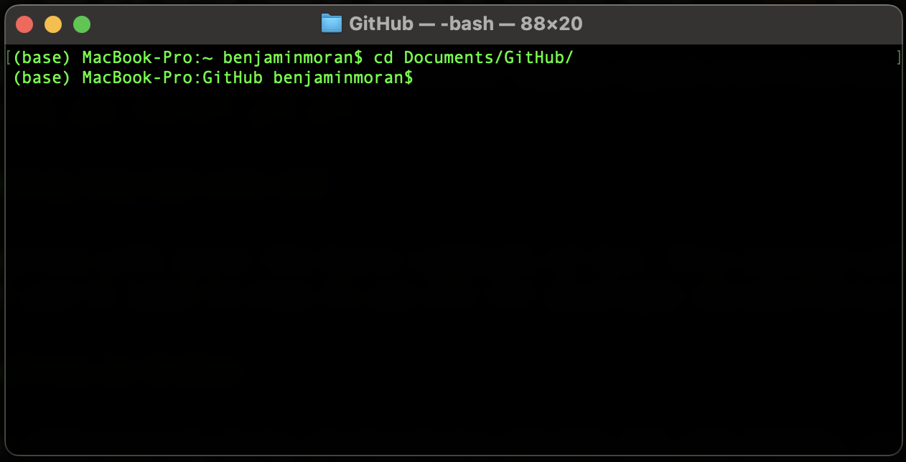
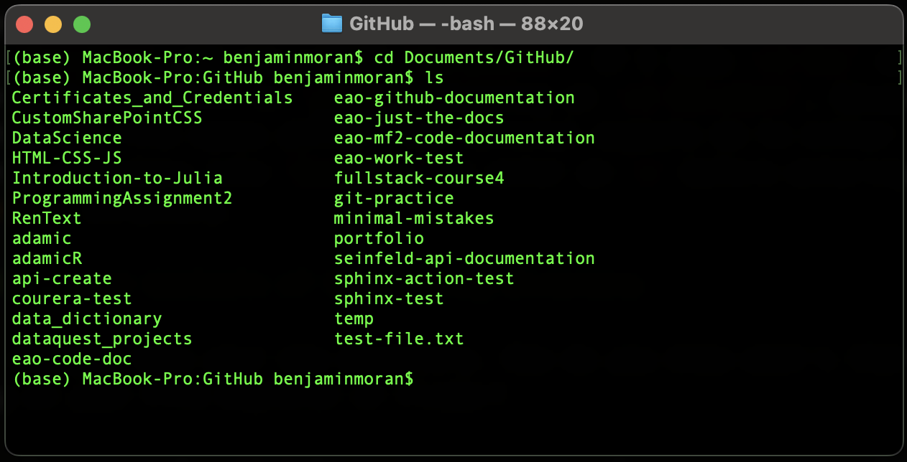

Increasingly, technical writing jobs require knowledge of something called "version control," and by far the most popular version control system is a program called [Git](https://git-scm.com/). It's commonplace now for TW job posts simply list Git as a required skill, without explain explaining what it is or how it relates to TW.

This page provides an explanation of what Git is and how to use it. I emphasize topics of interests to technical writers, especially those who write or are interested in writing developer documentation.

If you don't want to read the explanation of what Git is, you can jump to the either the [Git Instructions](#git-instructions) or [Git Cheat Sheet](#git-cheat-sheet).

## What Is Version Control?

Version control is simply a way of  tracking changes made to files stored within a directory on a computer. There's a bit more to it than that is a good enough definition for now.

## Why Should I Know Version Control?

Think about instances where you've collaborated on document with a peer using a program like Microsoft Word. Unless you were using a cloud-based version of Word in Microsoft Teams or SharePoint, you inevitably ran into situations where you had to maintain different file version. You probably exchanged several emails with attachments named `Working Document_v2`, `Working Document_v2.1`, or, God forbid, `Working Document_Final`. (And when that `Final` version proved to not really be "final," you may have another version called `Working Document_final_final`. Where does it end?)

If you've experienced situations like the one described above, you've already experienced the reason why version control is necessary. It's inevitable that the system described above will break down at some point. Someone will forget to download the latest version from their email, or someone will download the right version but forget to re-save with a different `_v<>` number. 

The other major headache with this approach is not knowing what changes were made in each file version. Even if you devised a fool-proof method for the suffix-based versioning system, how can you know which changes were associated with which version? Maybe you remember broadly what each version covers. But to version a document properly, you would need a computer-like memory for the details or every version—every paragraph, every word, every comma—and you would need to be able to hold those multiple versions in your head and compare them line-by-line. This is, for all intents and purposes, impossible.

Therefore, we need some way of systematically tracking changes from one version to the next, some way to understand what changes are associated with each version of a file. 

What we need is something called a version control system.

**TL;DR** You'll give yourself headaches (and future you will hate present you) if you manually save multiple versions of a file. 

## What Is a Version Control System?

A version control system (VCS) is a set of computational tools that allow users to systematically track changes to file or set of files within a specific repository. A VCS also allows for users to "roll back" to an earlier version of their file(s) if they so choose.

### What is Distributed Version Control?

There are two primary models of version control: centralized version control and distributed version control. 

With centralized version control, all users on a team save their changes on their personal computers and save their changes to a centralized system of record in a server. (The proper term is "committing" a change; more on this later.)

With distributed version control, each developer on a team maintains a copy of that system of record on their personal computer. When developers want to join their code with others, they submit their system of record to an orchestration system that registers differences between the various systems of record. That orchestration system allows developers to reconcile differences and merge the various systems of record into a single system of record.

Having said all that, distributed version control is what I'll be focused on in the rest of this article. While there are still teams out there that use centralized version control, distributed version control is far more popular because it's faster and it better enables collaboration between team members.

**TL;DR** In all likelihood, you'll only ever use distributed version control, so don't worry about the difference between it and centralized version.

## What is Git?

Git is a distributed VCS. It's by far the most popular VCS in the world.

Unlike many programs technical writers may be familiar with (MS Word, MadCap Flare, etc.), Git is a command line tool. It is directed by textual commands entered in the command line, not by the point-and-click direction of a mouse.

### Aside on the Command Line

For those technical writers that are unfamiliar with the command line, using it can be scary the first few times. You're totally going to break your computer if you enter the wrong character, right? (Nah, not likely.) 

Fear of the command line is completely understandable if you've never used it.But the fact is that the command line is, in many respects, superior to point-and-click direction once you get used to it. It's oftentimes far quicker. You can do things with it that you can't with your mouse. Using it brings you closer to the tools that developers use, helping to break down the barrier that can separate technical writers from their developer partners.

So don't fear the command line. Embrace it.

### Git and GitHub: Related But Distinct

You'll sometimes hear Git used interchangeably with [GitHub](https://github.com/). That's wrong. Git and GitHub are separate entities and do separate things. 

Git, again, is a distributed version control system used for tracking the history and details of various file states. Git is run from the command line.

GitHub, by contrast, is a website and server used for *storing* Git repositories and their files. It also has a few other key functions that I won't get into here.

What makes the distinction between Git and GitHub murkier is that, as their similar names might suggest, they are often used in tandem. Project developers will version control their code—and docs, as I'll describe further below— on their local computer using Git. When they are ready, they will "push" their files and the accompanying Git history to GitHub, where the files and Git history can be accessed by their co-developers.

While I won't describe them in detail here, you should know that GitHub isn't the only Git storage and orchestration website out there. [GitLab](https://about.gitlab.com/) and [Bitbucket](https://bitbucket.org/product) are two other examples.

So, one of the distinctions between Git and GitHub is that you can have Git without GitHub, but you can't have GitHub without Git. 

**TL;DR** Git is a command line tool for versioning code and documentation. GitHub is a website for storing Git repositories. Git and GitHub are often used in combination.

## Git Instructions

If you're ready to start using Git, this section is for you.

### Git Installation

#### For Mac

If you're on a Mac, you will install Git via [Homebrew](https://brew.sh/). To do that,
   
1. Open your Terminal (the command line on Mac).

2. Enter ```/bin/bash -c "$(curl -fsSL https://raw.githubusercontent.com/Homebrew/install/HEAD/install.sh)"```

3. Wait for the downloads to finish. This can take some time.
   
4. When Homebrew has finished installing, enter ```brew install git```.

#### For Windows

If you're on a Windows machine, 

1. Click [here](https://github.com/git-for-windows/git/releases/download/v2.38.1.windows.1/Git-2.38.1-64-bit.exe) to download the Git Installer.

2. Open the installer where you've downloaded it (likely your `Downloads` folder).
   
3. Progress through the installer menu, accepting the defaults.
  
#### For Linux

If you're on a Linux machine, the exact mechanism you'll use will vary by your distribution. 

1. Start by opening the Terminal. You might find this in your distribution by searching for "Shell."
2. Enter the command appropriate to your distribution.
   1. If you are using Fedora, RHEL, or CentOS, enter ```sudo dnf install git-all```.
   2. If you are using Ubuntu or another Debian-based distribution, enter ```sudo apt install git-all```

### Getting Started with Git

This section will cover the basic commands of Git. This section will cover 80% of what you'll need to know to use Git for developer documentation.

#### Setting up GitHub

Further underscoring murky distinctions between Git and GitHub, we'll start our Git journey by setting up a GitHub account. If you already have a GitHub account, skip to the next section. Note that if you're using GitHub for your job, you'll probably use a version of GitHub called GitHub Enterprise. If that's the case, you'll need to set up create a separate work account through GitHub Enterprise.

1. Navigate to [github.com](https://github.com/).
2. Click 'Sign up' in the upper-right.
3. Follow the prompts to set up your account.

### Two Key Non-Git Commands

In just a moment, you'll be using the command line to set up your local Git repository. But before you do that, you need to know a few non-Git commands. 

I'll keep things limited to the very basics here. If you're interested in learning more about the command line, check out my [Introduction to the Command Line for Technical Writers](../commandlineintro).

#### `cd`, Change Working Directory

When you open your command line application, the command line will default to working in some high-level directory (i.e., folder). It's probably not the one you want to be working in, so you'll need to change your directory. You'll need to do this each time you open a new command line window.

When you open your command line, you'll see a screen that looks like the following image. Your command line may look a little different, especially if you are using Windows' `PowerShell`. But functionally this should be the same.


The `~ benjaminmoran$` indicates the working directory. You can think of this as communicating the computer's present perspective: it currently sees the `/Users/benjaminmoran` folder and its contents and can perform actions on them.

However, most of the content you interact with is *not* stored in the default working directory that appears when you open a new terminal window (this is know as the "home directory"). If you want to perform actions on another directory's contents, you can either tell the machine where those other contents are or you can move the working directory to that location and perform actions on them there. It's generally easier to do the latter.

To move your working directory, you will enter: `cd <new directory>`, replacing `<new directory>` with the location that you want to work in. For example, I store my Git repositories in within my `Documents` folder. This image shows how I get there from my home directory:



I am now in my `GitHub` subfolder within `Documents`. Note that I didn't need to run multiple `cd` commands. I knew my `GitHub` folder was in my `Documents` directory, so I was able to jump two directories down with one command.

#### Tab Completion

There's a handy trick to make changing your directory even quicker: [tab completion](https://www.howtogeek.com/195207/use-tab-completion-to-type-commands-faster-on-any-operating-system/). When writing out a directory, for example, I can enter `TAB` after a couple of characters, and the terminal will fill in the directory. Here, I just typed `Doc` before hitting `TAB`, saving me a little bit of time. When you add up those little bits of time saved, though, you start to realize how much more efficient this is than navigating with your mouse. 

Note that, with tab completion, your computer looks for unique values based on your initial input. If it encounters two file or directory names with the same root, the terminal will stop at the point that the two file names differ. It then expects you to clarify which file or directory you intend to use. For example, imagine I have two subdirectories in my present working directory, one called `Document` and one called `Documents`. If I type `cd Doc` and hit `TAB`, the terminal will fill in `ument`, stopping at `cd Document`, because this is where the two file names differ. The terminal expects me to either hit `Enter` to change directory into `Document` or enter an `s` before entering into the `Documents` directory.

#### `ls`, List Contents of the Working Directory

You've changed into your new directory. How do you know what's there without looking at your File Explorer or Finder?

`ls` is here to help. `ls` lists the contents of your present working directory:



The only thing I want to point out here is that subdirectories and files are both printed here. Subdirectories do not have a file extension; files do. 


#### Setting Up a Repository

There are two ways to set up a new repository: 

- Initiating a repository on GitHub and cloning it your local computer
- Initiating one on your local computer

I typically do the former, so I'll give those instructions first. 

1. Sign in to GitHub.
2. Click the green "New" button.
3. On the new screen, enter a repository name. I recommend using underscores or hyphens to separate words in a repository name.
4. Keep the accessibility option set to "Public."
5. Click the green "Create repository" button.
6. On the new screen, copy your repository URL, which should appear within the "Quick Setup" pane. The URL will look something like this: `https://github.com/redsoxfan0219/git-demo.git`.
7. Open a new command line window.
  a. On Windows, open `PowerShell`.
  b. On Mac, open `Terminal`.
  c. On Linux, open `Terminal`.


### Connecting to GitHub

## Git Cheat Sheet

Coming soon!
