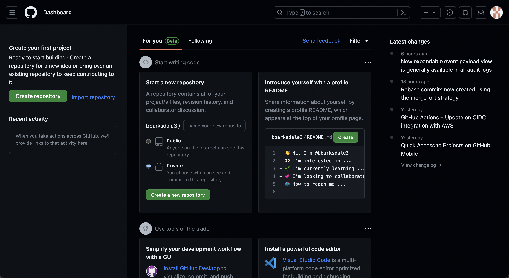

Since its founding in 2008, [GitHub](www.github.com) has grown to become a vital tool for most software and AI/ML teams. With the emergence of the [docs as code](https://www.writethedocs.org/guide/docs-as-code/) approach to technical writing, GitHub increasingly is a part of the technical writer's toolkit, too.

This page provides an explanation of what GitHub is, what its most important features are, and how to use it. I emphasize topics of interests to technical writers, especially those who write or are interested in writing developer documentation.

## What Is GitHub?

GitHub is a website and server used primarily by software developers to store projects and version their code with [Git](https://git-scm.com/). It is the world's most popular platform for storing code.

(If you don't know what Git is, check out my [Introduction to Git for Technical Writers](https://benbarksdale.netlify.app/docs/guides/introduction-to-git-for-technical-writers/).)

In addition to providing a place to store their code, GitHub enables developers to collaborate with one another easily.

## Why Should I Know about GitHub?

GitHub is often a key part of the docs as code approach to technical writing. 

Under this approach, documentation is written in a lightweight markup language (e.g., [Markdown](https://www.markdownguide.org/) or something similar); version controlled with Git; stored, edited, and revised on GitHub; rendered into HTML using a static site generator (e.g., [Jekyll](https://jekyllrb.com/), [Sphinx](https://www.sphinx-doc.org/en/master/), etc.), and finally hosted on [GitHub Pages](https://pages.github.com/), [Read the Docs](https://readthedocs.org/), [Netlify](https://www.netlify.com/), or another platform.

There are there are alternative tools (e.g., [GitLab](https://about.gitlab.com/)) that can take the place of GitHub in the docs as code approach. But the popularity of GitHub is the best reason to learn it over its competitors. 

Put simply, if you take a TW job where the docs as code approach is used, chances are good you'll be using GitHub every day.

## GitHub vs. Git

You'll sometimes hear GitHub used interchangeably with Git. That's wrong. Git and GitHub are separate entities and do separate things. 

Git is a version control system used for tracking the history and details of various file states. Git is run from the command line.

GitHub, by contrast, is a website and server that *uses* Git and *stores* Git repositories and their files. It also has a few other key functions that I'll explain at greater length below.

What makes the distinction between Git and GitHub murkier is that they are often used in tandem. Project developers will version control their code on their local computer using Git. When they are ready, they will "push" their files and accompanying Git history to GitHub, where the files and Git history can be viewed by their co-developers.

## GitHub Instructions

Ready to start using GitHub? This section is for you.

I'll start by walking you through how to set up and configure your GitHub account. Then, I'll outline four key skills you'll need to know to use GitHub effectively as a technical writer:

1. Setting up and navigating repositories
2. Setting up and working with branches
3. Working with Issues
4. Opening and using Pull Requests

If you learn these topics, you'll know almost everything you'll need to use GitHub as a technical writer.

### Getting Started with GitHub

#### Creating Your Account

While you don't need a GitHub account to access public GitHub repositories like [this one](https://github.com/redsoxfan0219/adamic), but you will need one to contribute to a repository. So let's start by setting up a new GitHub account.

To set up a new account, 

1. Navigate to [github.com](www.github.com) and click "Sign Up."
2. Follow the prompts to set your email, password, and username.
3. Retrieve the verification code from your email and enter it.
4. Ignore for now the various add-ons and offerings. Just click next.
5. Select the "free" option when asked if you'd like the free or premium option.

#### The Main Dashboard

The first screen you'll see after logging in is your user dashboard. It looks like this:

**More Coming Soon!**

