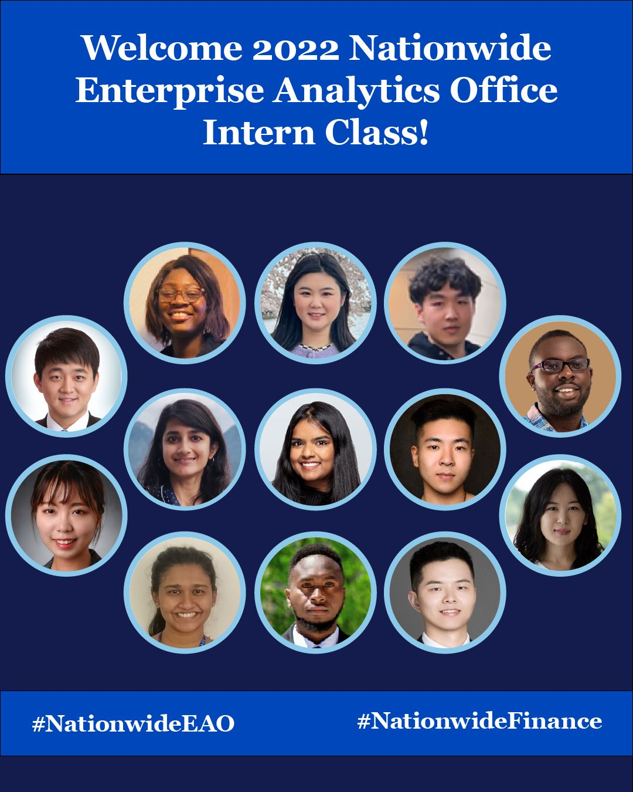

Occasionally, I've been asked to produce graphics for social media posts on sites like LinkedIn. My go-to software for such requests is Adobe Illustrator.

One recent request was for a graphic celebrating my department's cohort of incoming interns. I took pains to ensure consistency with enterprise-wide brand standards and recent section-wide guidance on social media engagement. Here's what I came up with:

