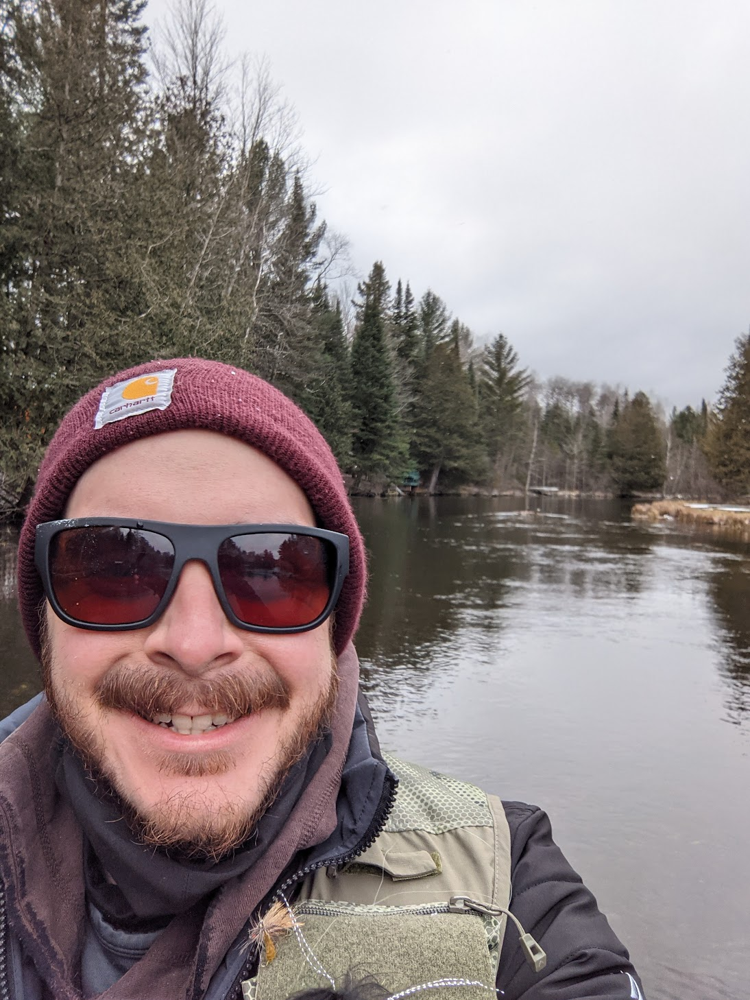
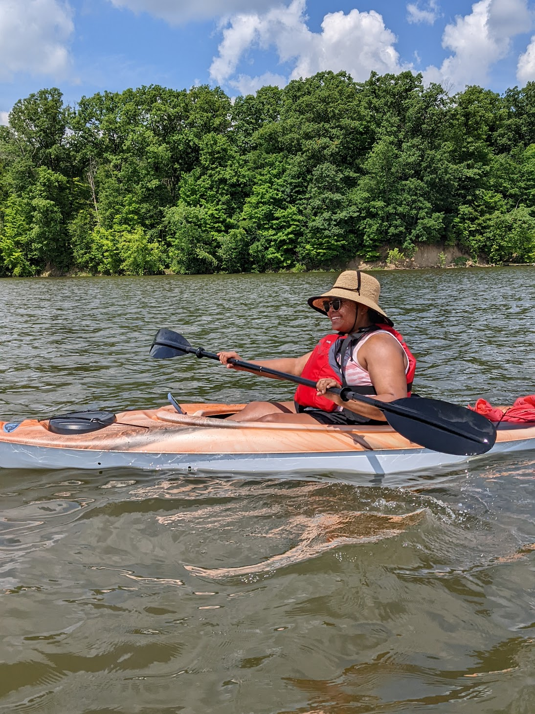
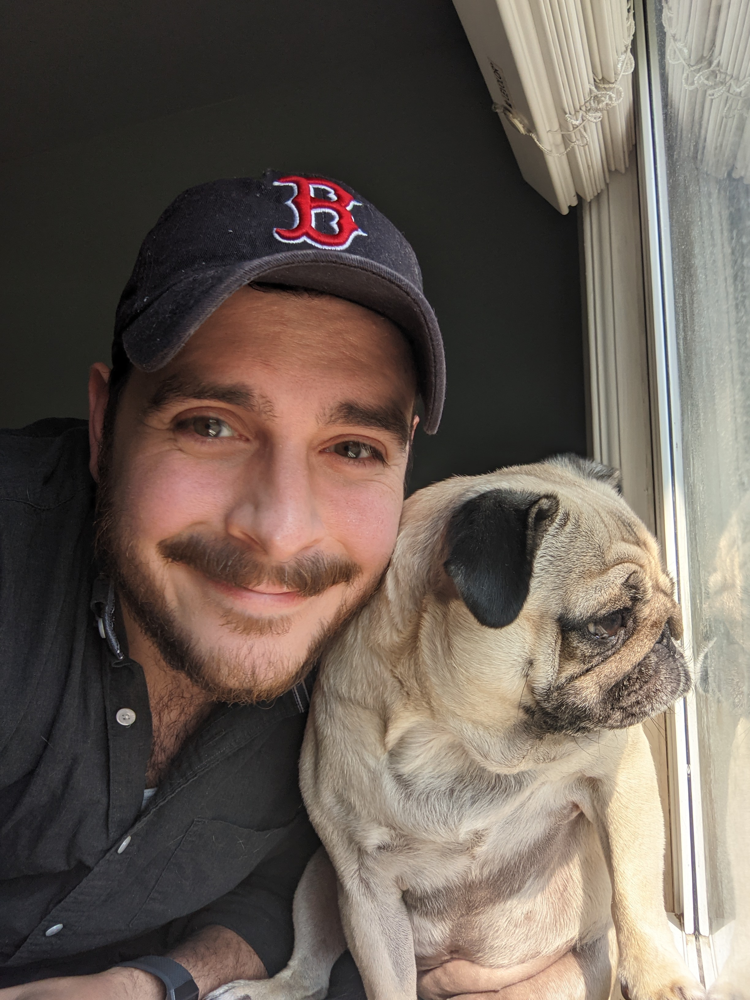

Before I started working in technical writing, I was an academic specializing in Renaissance English literature. I got my PhD at Ohio State. If you're having trouble sleeping, you can read my [dissertation](https://etd.ohiolink.edu/apexprod/rws_etd/send_file/send?accession=osu1594476712054021&disposition=inline).
  
As you might expect from someone who studied literature, I like to read a lot. I still read Renaissance literature occasionally — [Edmund Spenser](https://en.wikipedia.org/wiki/Edmund_Spenser) and [John Milton](https://en.wikipedia.org/wiki/John_Milton) are still among my favorites. I've also come to really enjoy the work of [Marcel Proust](https://en.wikipedia.org/wiki/Marcel_Proust). Beyond "highbrow literature", I read widely in sociology, politics, natural history, music, and popular science. [This](https://www.amazon.com/Orvis-Guide-Reading-Trout-Streams/dp/1558219331/ref=asc_df_1558219331/?tag=hyprod-20&linkCode=df0&hvadid=312091458201&hvpos=&hvnetw=g&hvrand=2904605359047339192&hvpone=&hvptwo=&hvqmt=&hvdev=c&hvdvcmdl=&hvlocint=&hvlocphy=9014973&hvtargid=pla-570146944530&psc=1&tag=&ref=&adgrpid=63669393113&hvpone=&hvptwo=&hvadid=312091458201&hvpos=&hvnetw=g&hvrand=2904605359047339192&hvqmt=&hvdev=c&hvdvcmdl=&hvlocint=&hvlocphy=9014973&hvtargid=pla-570146944530), [this](https://www.amazon.com/Black-Kids-Sitting-Together-Cafeteria/dp/0465060684/ref=sr_1_1?crid=13E2OOUSWXOAT&keywords=Why+Are+All+The+Black+Kids+Sitting+Together+in+the+Cafeteria%3F&qid=1655952523&s=books&sprefix=why+are+all+the+black+kids+sitting+together+in+the+cafeteria+%2Cstripbooks%2C62&sr=1-1), and [this](https://www.amazon.com/Every-Good-Boy-Does-Fine-ebook/dp/B0B3WDP82Z/ref=sr_1_1?crid=160QYCH2FL3UB&keywords=every+good+boy+does+fine+jeremy+denk&qid=1655952534&s=books&sprefix=every+good+%2Cstripbooks%2C78&sr=1-1) are a few books I read recently and enjoyed.
  
During the pandemic, a friend introduced me to [fly fishing](https://en.wikipedia.org/wiki/Fly_fishing), which has become a big part of my life. I try to spend at least a couple days a month on a river — even in the winter. Here's a photo of me on the [Au Sable River](https://en.wikipedia.org/wiki/Au_Sable_River_(Michigan)) in Michigan in December. It was a very brisk 29°F with a wind chill of 6°! And, alas, no fish that day to offset the bitter cold.

I also like spending time with my family. My wife Nadia and I have been married for about five years. We recently got kayaks that we've been enjoying taking them out on the local waterways.

We also have a pug named Maple, who likes to think of herself as a guard dog. In truth, she's better at sleeping than she is at scaring away the mailman and local joggers. Occasionally, she'll take a break from her busy life to pose for a photo.

